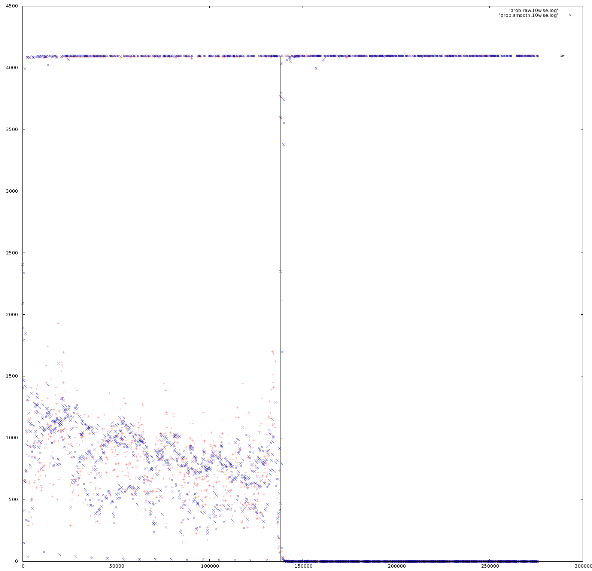

# plm
PLM-1 is a research data compressor designed specifically for studying and computing the Normalized Compression Distance (NCD), a scale-free, parameter-free distance between binary strings. The NCD can be a powerful tool in machine learning and exploratory data analysis, particularly when the character or source of the binary strings is unknown.

## Theory
### Normalized information distance
The NCD is an effective approximation of the Normalized Information Distance, which is defined in terms of prefix-free Kolmogorov complexity (which is not computable). 

In essence, two binary sequences are more similar the more information that they know about eachother, which is formally captured by the conditional Kolmogorov complexity *K(x|y)* of a binary sequence *x* given binary input *y*. 

### Normalized compression distance
Even though Kolmogorov complexity is not computable, it is effectively approximable from above. Choose some data compressor, and binary string *x*, and let *Z(x)* be the length in bits of the compressed version of the string.

Rather than conditional Kolmogorov complexity, we look at how much we can compress one string, given another. In `plm`, we train a neural network using sequence A as input, then see how much we can compress (predict bits in) sequence B using that same neural network.

### Problems in practice
In their paper first describing the NCD, Cilibrasi and Vitanyi outlined a group of "normality axioms" that, if satisfied by a data compressor, guarantee that the resulting NCD was a metric. 

They also proposed a number of popular compression algorithms to be used, however did not seriously test their compliance with the axioms. In fact, `gzip`, `bzip2`, `ppmz`, `gencompress`, and others, do **not** satisfy the normality axioms, despite being recommended.

## Compression
PLM-1 operates on binary streams using arithmetic coding to compress each bit, builds predictive models based on dynamic contexts, and usees a neutral network to perform context mixing, blending the models to give a better prediction. 

This approach is heavily inspired by `paq7`/`paq8`, which themselves nearly satisfy the axioms. However PLM-1 is written in C (rather than C++) and is a good deal simpler. This makes it easier to perform research with.

